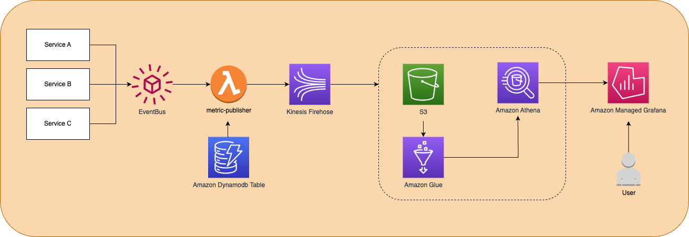

<h1>Architecture</h1>



<br>

### <b>Features</b>
* Publish metric to kinesis
* Data Encryption (optional) 
* Dynamic Partitioning
  - It calls a lambda processor to add PKs and create the dynamic paths on S3 bucket on the following rule:
    `!{partitionKeyFromLambda:category}/!{partitionKeyFromLambda:tenantId}/!{partitionKeyFromLambda:year}/!{partitionKeyFromLambda:month}/!{partitionKeyFromLambda:day}/{partitionKeyFromLambda:hour}`
* Data search (Athena + Glue tables)
* UI with Managed Grafana

### <b>Refactoring</b>
* Add tags to infrastructure resources (WIP)

### <b>Roadmap</b>
* Changelog
* License

### <b>Authentication (Out of scope)</b>

* [Google SAML Setup](https://aws-observability.github.io/observability-best-practices/recipes/recipes/amg-google-auth-saml/#:~:text=Login%20to%20Google%20Workspaces%20with%20Super%20Admin%20permissions%20and%20go%20to%20Web%20and%20mobile%20apps%20under%20Apps%20section)
* [Using SAML with your Amazon Managed Grafana workspace](https://docs.aws.amazon.com/grafana/latest/userguide/authentication-in-AMG-SAML.html)
* [Using AWS IAM Identity Center](https://docs.aws.amazon.com/grafana/latest/userguide/authentication-in-AMG-SSO.html)

<br>

<h2>Local Setup</h2>

### <b>Localstack setup</b>

```
1.1) Install:
pip3 install localstack
pip3 install awscli-local

1.2) AWS Configure:
aws configure --profile test #or whatever profile name

1.3) Start localstack:
localstack start -d

alias awslocal="AWS_ACCESS_KEY_ID=test AWS_SECRET_ACCESS_KEY=test AWS_DEFAULT_REGION=${DEFAULT_REGION:-$AWS_DEFAULT_REGION} aws --endpoint-url=http://${LOCALSTACK_HOST:-localhost}:4566"

2) References:

- https://github.com/localstack
- https://github.com/localstack/awscli-local
```

### <b>Tests</b>

* The following object is a demo payload from EventBridge. For the test you'll need an tenant id generated by migrations `lib/migration/resources/scripts/001_create-tenants.ts`
```

Detail Type: serviceA.metric.received
Source: serviceA.metric

{
  "tenantId": "d57656d6-bd8e-4d6e-8ebc-4ce38f0bb2c4",
  "category": "sales",
  "metric": {
    "month": 1,
    "year": 2022,
    "starting-mrr": 4000,
    "new-biz-mrr": 1000,
    "expansion-mrr-prev-month": 50,
    "expansion-mrr-current-month": 100,
    "contraction-mrr": 200,
    "churned-mrr": 50,
    "ending-mrr": 4850,
    "starting-customers": 20,
    "new-customers": 5,
    "churned-customers": 1,
    "ending-customers": 24,
    "sales-marketing-expenses": 10000,
    "gross-margin": 0.8
  },
  "metadata": {
    "service": "oblong-inquiry.com",
    "domain": "tricky-nerve.org",
    "route": "https://salty-premium.biz",
    "requestId": "4ee89d93-7919-4e93-b027-dc1b58192562"
  }
}
```